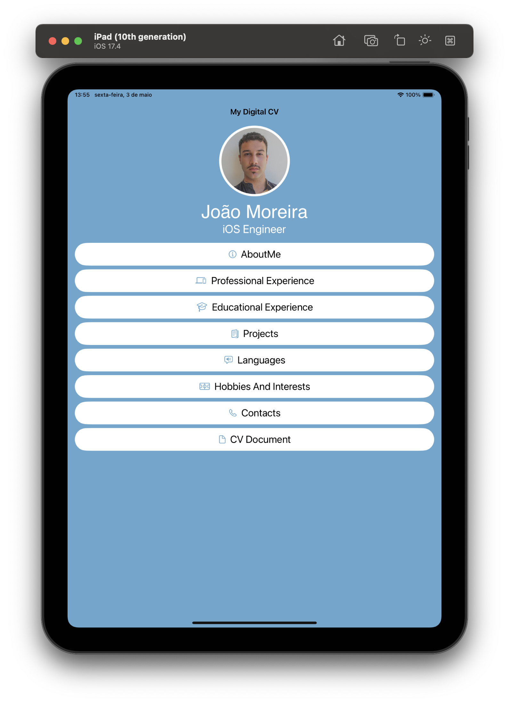
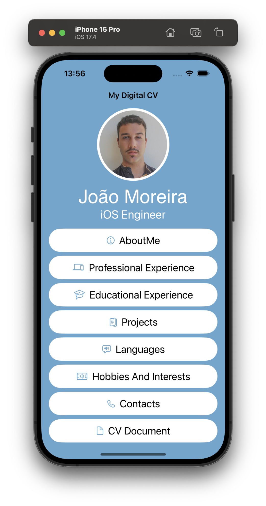
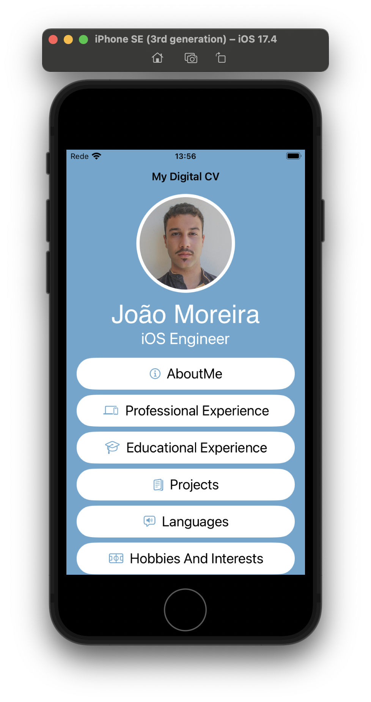

# CV-JoaoMoreira

## Brief introduction

The idea of creating this app came from letting recruiters know my technical skills in iOS development.

The application is a representation of my CV in app form.

Hope you like it :)

## Technologies

The app was developed taking into account the cutting edge of innovation in iOS development, that is, using Swift as the programming language and SwiftUI as the Interface Builder.

I tried to use the MVVM pattern, however, as there is almost no logic, I considered that it would not be advantageous to have the ViewModel layer.

## Compatibility

As I used SwiftUi, I can have a functional application with almost no effort on both large screens like the iPad, regular screens on newer iPhone models and smaller screens like older iPhones.

| iPad       |  iPhone (regular screen)            | iPhone (small screen)
| ------     | -----                               | ------------
|  |   | 

